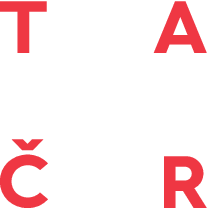

# Endorse - experiment

This repository is work in progress fork for
work on the Bukov 2 mine-by experiment.

Purpose is to quickly perform sensitivity analysis
of the HM prediction of pore pressures with respect to 
main input parameters.

The entrypoints are:
- src/endorse/Bukov2/*
- src/endorse/sa ... more consistent SA interface
- tests/Bukov2 ... tests of SALib and other specific tools

## How to compute
1. setup environment:
    ```
    bin/setup_venv
    ```
    That would recreate virtual environment from the scratch.
    On Charon, you need a Python module and you need the same module 
    on computing nodes. The simples way to deal with this entry constrain is to  
    add it into `.bashrc`:
    ```
    source /cvmfs/software.metacentrum.cz/modulefiles/5.1.0/loadmodules
    module load python/3.9.12-gcc-10.2.1-rg2lpmk
    ```

2. Plan and compute raw samples. (TBD by Paulie)
3. Collect samples. 
    ```
    cd tests/Bukov2
    ./ptyhon collect_hdf.py <dir_with_hdfs>
    ```
    This would merge HDFs into single file and in the second phase 
    the complete sample groups are extracted. Few missing values are imputted 
    by the mean. Reduced dataset is formed for testing and debugging.
4. Extract borehole data.
    ```
    cd tests/Bukov2
    ./ptyhon borehole_data.py <dir_with_hdfs>
    ```
    Workdir `<dir_with_hdfs>` must contain the cofig file `Bukov2_mesh.yaml`.
    For every borehole the sample data in discrete points are extracted. 
    Boreholes are in separate files under `workdir/borehole_data` in oredr to 
    simplify parallel processing.  

5. Borehole calculations.
   ```
    cd tests/Bukov2
    ./ptyhon process_boreholes.py <dir_with_hdfs> [i_bh]
   ```
   If `i_bh` is given:
   Borehole precalculation. 
   Borehole summary plot.
   Borehole packer optimization.
   
    Otherwise start PBS parallel processing of all boreholes.

6. Global measurement optimization.
## original Endorse readme for reference

The software implements specialized safety calculations for the excavation disturbed zone (EDZ)
of a deep repository of radioactive waste. It consists of two parts: 
1. determination of the rock parameters using the Bayesian inversion
2. stochastic prediction of the contamination transport and safety indicator evaluation

It essentially use the simulator [Flow123d](https://flow123d.github.io/) of processes in fractured rocks.

## Prerequisities

The software requires a working [Docker Desktop](https://www.docker.com/) 
installation or [SingularityCE](https://docs.sylabs.io/guides/latest/user-guide/quick_start.html) installation.
The first is better for local desktop usage, while the latter is usually the only option on HPC clusters. 
The use of clusters is recommended, as stochastic simulations are pretty computationally demanding. 
Currently, only the Linux installations are tested but should run 
with little effort on Windows due to containerization.


## Quick start

1. Download the latest version of the sources as a ZIP package.
2. Extract to the directory of your choice.
3. Set up the computational container with the proper environment using the `bin/endorse-setup` tool.
3. Create a working directory on a filesystem shared between computational nodes.
4. Prepare main configuration files.
5. Run Bayes inversion (`bin/endorse-bayes`) or stochastic transport (`bin/endorse-mlmc`).

See [full documentation](doc/main.md) for the details.


## Acknowledgement


|  |Development of the Endorse software was supported by <br> Technological agency of Czech republic <br>in the project no. TK02010118 of the funding programme Theta.|
|:---:|:---|
### Authors

**[Technical university of Liberec](www.tul.cz)**

- **Jan Březina** coordination, stochastic transport
- **Jan Stebel** hydro-mechanical model in Flow123d
- **Pavel Exner** Bayes inversion for the EDZ
- **Martin Špetlík** [MLMC](https://pypi.org/project/mlmc/) library and homogenization

**[Institute of Geonics](https://www.ugn.cas.cz/?l=en&p=home)**

- **Stanislav Sysala** plasticity model
- **Simona Bérešová** core Bayes inversion library [surrDAMH](https://github.com/dom0015/surrDAMH)
- **David Horák, Jakub Kružík** [PERMON](http://permon.vsb.cz/) library integration for fracture contacts in Flow123d

### Coauthors
- **David Flanderka** Flow123d, optimizations, technicalities 
- **Radek Srb** containerization
- **Michal Béreš** consultation, tests

## Developers corner


### Repository structure:

- `doc` - software documentation and various reports from the Endorse project
- `experiments` - various numerical experiments and developments as part of the Endorse project
- `src` - main sources
- `tests` - various software tests, test data


### Development environment
In order to create the development environment run:

        setup.sh
        
As the Docker remote interpreter is supported only in PyCharm Proffesional, we have to debug most of the code just with
virtual environment and flow123d running in docker.
        
More complex tests should be run in the Docker image: [flow123d/geomop-gnu:2.0.0](https://hub.docker.com/repository/docker/flow123d/geomop-gnu)
In the PyCharm (need Professional edition) use the Docker plugin, and configure the Python interpreter by add interpreter / On Docker ...

